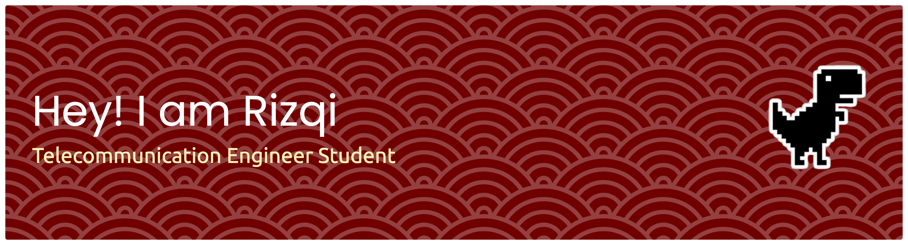

# Introduction
Hi! I'm Rizqi, an Telecommunication Engineering student @ Institut Teknologi Bandung. 
Currently, my interest are network security practices. I am also currently a mobility student @ Universiti Malaya to take business-related and computer science courses.

  <!-- Link to the uploaded image -->

## GitHub Profile

📡 I'm currently studying Telecommunication with a focus on network security projects. My goal is to understand deeper about the topic and maintain security of my future projects.

---

### Skills

Skills that I maintain:

📋 Languages

   

📚 Frameworks, Platforms and Libraries

 

☁️ Hosting/SaaS

   

🎛️ Operating System

  

🥅 Other

   
